# Travel Buddy Platform

A comprehensive AI-powered travel platform built with Next.js, TypeScript, and Supabase. Travel Buddy enables users to discover, create, and share travel experiences while leveraging advanced AI capabilities for personalized recommendations and content generation.

## 🚀 Key Features

### 1. AI-Powered Travel Assistant
- **Multi-Model AI Integration**: Utilizes OpenAI, Google GenAI, Anthropic, and HuggingFace models
- **LangChain Framework**: Advanced prompt engineering and agent-based conversations
- **Intent Classification**: Intelligent query understanding and routing
- **Image Analysis**: AI-powered image recognition for travel content
- **Smart Recommendations**: Personalized travel suggestions based on user preferences

### 2. Experience Management System
- **CRUD Operations**: Full lifecycle management of travel experiences
- **Rich Media Support**: Photo and video uploads with Supabase Storage integration
- **Address-Based Grouping**: Experiences organized by geographical locations
- **Company Ownership**: Multi-tenant architecture with company-based experience ownership
- **Status Management**: Active, inactive, and internal experience states
- **Translation Support**: Multi-language content with automatic translation

### 3. User Authentication & Authorization
- **Supabase Auth Integration**: Secure JWT-based authentication
- **Multiple Auth Methods**: Email/password, OAuth providers, OTP verification
- **Password Management**: Reset and recovery functionality
- **Session Management**: Secure token handling and refresh
- **Role-Based Access Control**: Different permission levels for users

### 4. Company Management
- **Multi-Tenant Architecture**: Support for multiple companies/organizations
- **Member Management**: Add, remove, and manage company members
- **Editor Roles**: Special permissions for content editors
- **Business Profiles**: Comprehensive company profile management
- **Ownership Tracking**: Clear ownership hierarchy for all content

### 5. Story Generation & Sharing
- **AI-Powered Story Creation**: Automatic travel story generation
- **Social Features**: Comments, likes, and sharing functionality
- **Content Management**: Full CRUD operations for stories
- **Regeneration Capability**: AI-powered story regeneration
- **Public/Private Stories**: Flexible privacy controls

### 6. Media & Storage Management
- **File Upload System**: Secure file handling with validation
- **Supabase Storage**: Cloud-based media storage
- **Image Processing**: Automatic optimization and resizing
- **Asset Management**: Organized media library

### 7. Analytics & Insights
- **User Behavior Tracking**: Comprehensive analytics system
- **Engagement Metrics**: Detailed interaction analytics
- **Performance Monitoring**: System performance insights

### 8. Communication & Notifications
- **Email Integration**: SendGrid and MailerSend support
- **Notification System**: Automated user notifications
- **Template Management**: Customizable email templates

## 🏗️ Architecture Overview

### Tech Stack
- **Frontend**: Next.js 15, React 18, TypeScript, Material-UI
- **Backend**: Next.js API Routes, Supabase (PostgreSQL)
- **State Management**: Redux Toolkit
- **AI/ML**: LangChain, OpenAI, Google GenAI, Anthropic, HuggingFace
- **Storage**: Supabase Storage
- **Authentication**: Supabase Auth with JWT
- **Deployment**: Vercel with Turbopack

### System Architecture

```mermaid
graph TB
    subgraph "Client Layer"
        UI["🖥️ Next.js Frontend<br/>React + TypeScript + Material-UI"]
        State["🗃️ Redux Store<br/>Global State Management"]
    end
    
    subgraph "API Layer"
        API["🔌 Next.js API Routes<br/>/pages/api/*"]
        MW["🛡️ Middleware<br/>Auth + CORS"]
    end
    
    subgraph "AI Services"
        LangChain["🤖 LangChain Agents"]
        OpenAI["🧠 OpenAI GPT"]
        Google["🔍 Google GenAI"]
        Anthropic["💭 Anthropic Claude"]
        HF["🤗 HuggingFace"]
    end
    
    subgraph "Database & Storage"
        Supabase["🗄️ Supabase PostgreSQL<br/>Users, Experiences, Stories"]
        Storage["📁 Supabase Storage<br/>Media Files"]
        Auth["🔐 Supabase Auth<br/>JWT Authentication"]
    end
    
    subgraph "External Services"
        Email["📧 SendGrid/MailerSend"]
        AgentServer["🤖 External Agent Server"]
    end
    
    UI --> State
    UI --> API
    API --> MW
    MW --> Supabase
    MW --> Auth
    API --> LangChain
    LangChain --> OpenAI
    LangChain --> Google
    LangChain --> Anthropic
    LangChain --> HF
    API --> Storage
    API --> Email
    API --> AgentServer
    
    style UI fill:#e1f5fe
    style API fill:#f3e5f5
    style Supabase fill:#e8f5e8
    style LangChain fill:#fff3e0
```



### Project Structure
```
travel-buddy-prj/
├── app/                    # Next.js App Router components
│   ├── components/         # Reusable UI components
│   ├── Layout/            # Layout components
│   └── utils/             # Client-side utilities
├── pages/api/             # API endpoints
│   ├── auth/              # Authentication endpoints
│   ├── experiences/       # Experience management
│   ├── companies/         # Company management
│   ├── story/             # Story generation & management
│   ├── agents/            # AI agent endpoints
│   ├── analytics/         # Analytics endpoints
│   └── profile/           # User profile management
├── libs/                  # Shared libraries
│   ├── supabase/          # Database client configuration
│   ├── services/          # Business logic services
│   └── agents/            # AI agent implementations
├── supabase/              # Database migrations & config
├── database.types.ts      # TypeScript database types
└── middleware.ts          # Request middleware & CORS
```

### User Journey Flow


### API Request Flow

```mermaid
sequenceDiagram
    participant Client as 📱 Client App
    participant MW as 🛡️ Middleware
    participant API as 🔌 API Route
    participant Auth as 🔐 Supabase Auth
    participant DB as 🗄️ Database
    participant AI as 🤖 AI Service
    participant Storage as 📁 File Storage
    
    Client->>MW: HTTP Request + JWT Token
    MW->>Auth: Validate JWT Token
    Auth-->>MW: Token Valid/Invalid
    
    alt Token Valid
        MW->>API: Forward Request
        API->>DB: Query/Mutation
        DB-->>API: Data Response
        
        opt AI Processing Needed
            API->>AI: Process with AI
            AI-->>API: AI Response
        end
        
        opt File Upload
            API->>Storage: Store Media
            Storage-->>API: File URL
        end
        
        API-->>Client: Success Response
    else Token Invalid
        MW-->>Client: 401 Unauthorized
    end
```



### Database Entity Relationships


### AI Workflow & Processing

```mermaid
flowchart TD
    A["👤 User Input<br/>(Text/Images/Query)"] --> B{"🧠 Intent Classification"}
    
    B -->|Chat| C["💬 LangChain Chat Agent"]
    B -->|Search| D["🔍 AI-Powered Search"]
    B -->|Story Generation| E["📝 Story Generator"]
    B -->|Image Analysis| F["🖼️ Image Recognition"]
    
    C --> G["🤖 Multi-Model Processing"]
    D --> G
    E --> G
    F --> G
    
    G --> H["🧠 OpenAI GPT"]
    G --> I["🔍 Google GenAI"]
    G --> J["💭 Anthropic Claude"]
    G --> K["🤗 HuggingFace Models"]
    
    H --> L["🔄 Response Aggregation"]
    I --> L
    J --> L
    K --> L
    
    L --> M["✨ Enhanced Response"]
    M --> N["📊 Context Storage"]
    M --> O["👤 User Response"]
    
    style A fill:#e3f2fd
    style G fill:#fff3e0
    style L fill:#f3e5f5
    style O fill:#e8f5e8
```



### Feature Integration Overview


## 🛠️ Development Setup

### Prerequisites
- Node.js 18+ and npm/pnpm
- Supabase account and project
- API keys for AI services (OpenAI, Google, Anthropic)
- Email service credentials (SendGrid/MailerSend)

### Environment Variables
Create a `.env.local` file with the following variables:
```bash
# Supabase Configuration
NEXT_PUBLIC_SUPABASE_URL=your_supabase_url
NEXT_PUBLIC_SUPABASE_ANON_KEY=your_supabase_anon_key
SUPABASE_SERVICE_ROLE_KEY=your_service_role_key

# AI Service APIs
OPENAI_API_KEY=your_openai_key
GOOGLE_GENAI_API_KEY=your_google_key
ANTHROPIC_API_KEY=your_anthropic_key
HUGGINGFACE_API_KEY=your_huggingface_key

# Email Services
SENDGRID_API_KEY=your_sendgrid_key
MAILERSEND_API_KEY=your_mailersend_key

# External Services
AGENT_SERVER_URL=your_agent_server_url
```

### Installation & Setup
```bash
# Clone the repository
git clone <repository-url>
cd travel-buddy-prj

# Install dependencies
pnpm install

# Set up Supabase (see SUPABASEReadMe.md for detailed instructions)
npx supabase login
supabase link --project-ref <your-project-id>
supabase db pull

# Run development server
pnpm dev
```

### Database Setup
Refer to `SUPABASEReadMe.md` for detailed Supabase setup instructions including:
- Project linking
- Migration management
- Database schema updates

## 📚 API Documentation

The project includes comprehensive API documentation via Swagger. Access it at:
- Development: `http://localhost:3000/api/docs`
- Production: `https://your-domain.com/api/docs`

### Key API Endpoints

#### Authentication (`/api/auth/`)
- `POST /login` - User login
- `POST /sign-up` - User registration
- `POST /oauth` - OAuth authentication
- `POST /forgot-password` - Password reset request
- `POST /reset-password` - Password reset confirmation

#### Experiences (`/api/experiences/`)
- `GET /get-all` - List all experiences
- `POST /create` - Create new experience
- `PUT /update` - Update experience
- `DELETE /delete` - Delete experience
- `GET /public/address/get` - Get experiences by address (public)

#### Companies (`/api/companies/`)
- `GET /get-all` - List all companies
- `POST /members/create` - Add company member
- `POST /editors/create` - Add company editor
- `GET /editors/get` - Get company editors

#### Stories (`/api/story/`)
- `GET /get-all` - List all stories
- `POST /create` - Create new story
- `POST /generate` - AI-generate story
- `POST /likes/toggle` - Toggle story like
- `POST /comments/create` - Add comment

#### AI Agents (`/api/agents/`)
- `POST /chat` - Chat with AI agent
- `POST /search` - AI-powered search
- `POST /intent-classifier` - Classify user intent

## 🧑‍💻 Developer Guidelines

### Code Organization
1. **API Routes**: Follow RESTful conventions in `/pages/api/`
2. **Components**: Create reusable components in `/app/components/`
3. **Services**: Business logic goes in `/libs/services/`
4. **Types**: Use TypeScript types from `database.types.ts`
5. **Utilities**: Helper functions in respective `utils/` directories

### Database Patterns
1. **Supabase Client**: Use `createApiClient()` for authenticated requests
2. **RPC Functions**: Leverage PostgreSQL functions for complex queries
3. **Row Level Security**: Implement RLS policies for data access control
4. **Migrations**: Always use Supabase CLI for schema changes

### Authentication Flow
1. **JWT Tokens**: All API routes (except `/public/`) require authentication
2. **Middleware**: `middleware.ts` handles CORS and auth validation
3. **Token Refresh**: Implement proper token refresh logic
4. **Role Checking**: Validate user roles for protected operations

### AI Integration Best Practices
1. **Error Handling**: Implement robust error handling for AI services
2. **Rate Limiting**: Consider API rate limits for AI providers
3. **Fallback Strategies**: Have fallbacks when AI services are unavailable
4. **Prompt Engineering**: Use structured prompts in LangChain agents

### Testing & Quality
1. **TypeScript**: Maintain strict type checking
2. **ESLint**: Follow the configured linting rules
3. **Error Boundaries**: Implement proper error handling
4. **Logging**: Use structured logging for debugging

### Deployment
1. **Environment Variables**: Ensure all required env vars are set
2. **Build Process**: Test builds locally before deployment
3. **Database Migrations**: Run migrations before deploying
4. **Health Checks**: Implement API health check endpoints

### Common Development Tasks

#### Adding a New API Endpoint
1. Create the endpoint file in appropriate `/pages/api/` subdirectory
2. Implement proper authentication and validation
3. Add TypeScript types for request/response
4. Update Swagger documentation
5. Test with different user roles

#### Adding a New Database Table
1. Create migration using `supabase migration new <name>`
2. Write SQL in the migration file
3. Update `database.types.ts` with new types
4. Implement RLS policies if needed
5. Push migration with `supabase db push`

#### Integrating New AI Features
1. Add new service in `/libs/services/agents/`
2. Implement proper error handling and fallbacks
3. Add configuration for new AI provider
4. Test with various input scenarios
5. Update documentation

## 🚀 Getting Started for Junior Developers

### 1. Understanding the Codebase
- Start by exploring the `/pages/api/` directory to understand available endpoints
- Review `database.types.ts` to understand the data model
- Check existing components in `/app/components/` for UI patterns

### 2. Local Development Workflow
1. Set up environment variables (copy from team lead)
2. Install dependencies: `pnpm install`
3. Start development server: `pnpm dev`
4. Access API docs at `http://localhost:3000/api/docs`
5. Test API endpoints using the Swagger interface

### 3. Making Your First Contribution
1. Pick a small feature or bug fix
2. Create a new branch: `git checkout -b feature/your-feature-name`
3. Make changes following the coding patterns
4. Test your changes thoroughly
5. Submit a pull request with clear description

### 4. Common Gotchas
- Always use `createApiClient(token)` for authenticated Supabase requests
- Remember to handle both success and error cases in API responses
- Check user permissions before allowing data modifications
- Use TypeScript types consistently throughout the codebase

### 5. Resources for Learning
- [Next.js Documentation](https://nextjs.org/docs)
- [Supabase Documentation](https://supabase.com/docs)
- [LangChain Documentation](https://js.langchain.com/docs/)
- [Material-UI Documentation](https://mui.com/)

## 📞 Support & Contact

For questions, issues, or contributions:
1. Check existing documentation and API docs
2. Review similar implementations in the codebase
3. Consult with senior developers
4. Create detailed issue reports with reproduction steps

---

**Happy Coding! 🎉**
